# RISK-XVII VM

RISK-XVII virtual machine project with two clearly separated runtimes:

- **CLI VM (C):** native binary execution of `.mi` memory images
- **Web VM (Next.js):** interactive simulator with builder, trace panels, memory/heap views, and docs

<details open>
<summary><strong>CLI VM (C)</strong></summary>

### What it provides

- RISK-XVII instruction execution in native C
- Virtual routines support
- Heap bank allocation support
- Example programs and test script

### Location

- `cli/vm_riskxvii.c`
- `cli/vm_riskxvii.h`
- `cli/Makefile`
- `cli/examples/`
- `cli/README.md` (detailed CLI usage)

### Build and run

```bash
make
./cli/vm_riskxvii <memory_image_binary>
```

Example:

```bash
./cli/vm_riskxvii ./cli/examples/printing_h/printing_h.mi
```

</details>

<details open>
<summary><strong>Web VM (Next.js)</strong></summary>

### What it provides

- Instruction Builder and Program queue
- Step/Run execution
- Bit Trace and Flags
- Registers panel
- Data Memory and Heap Memory windows
- Heap Banks Allocation view
- Built-in docs panels (instruction groups, PC/memory/heap, virtual routines)
- `/api/run` wrapper to execute `.mi` through the native CLI binary

## Feature Blocks

This project supports the following VM capability blocks:

- Instruction execution core
  - Arithmetic & logic block
  - Memory access block
  - Program flow block (branch/jump)
- Execution observability
  - Program builder + program queue
  - Step/Run control
  - Bit trace and flags
  - Register panel
- Memory systems
  - Data memory window (`0x0400-0x07FF`)
  - Heap memory window (`0xB700-0xD6FF`)
  - Heap bank allocation view (`128 x 64B`)
- Virtual routines / I/O
  - Console read/write
  - Halt / dump routines
  - Heap malloc/free routines
- Error handling
  - Illegal operation reporting
  - Unsupported instruction reporting

### Location

- `web/app/page.tsx`
- `web/app/globals.css`
- `web/app/api/run/route.ts`
- `web/README.md`

### Run web app

```bash
cd web
npm install
npm run dev
```

Open `http://localhost:3000`.

</details>

## Screenshots (Web)

The UI screenshots are organized under `docs/images/`.

### Program Construction & Execution

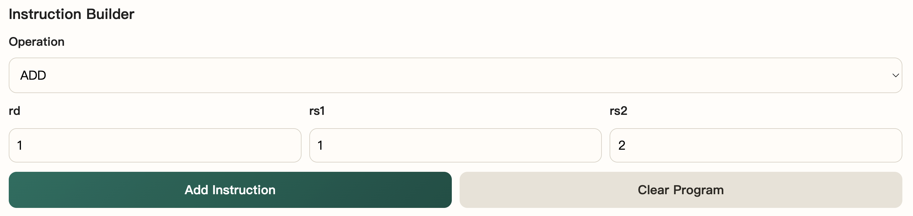
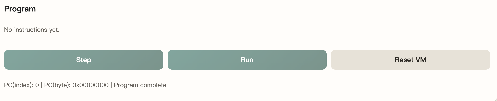

### Trace & Machine State

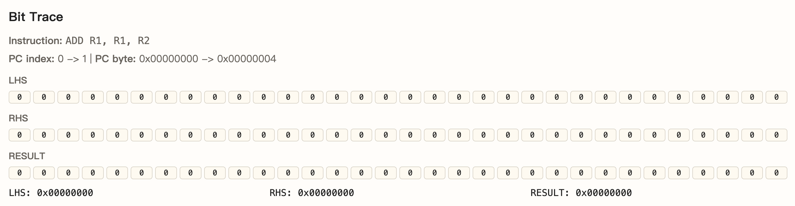
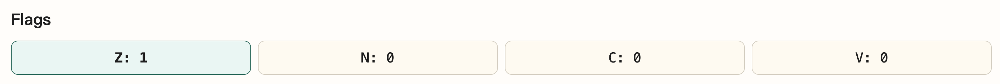
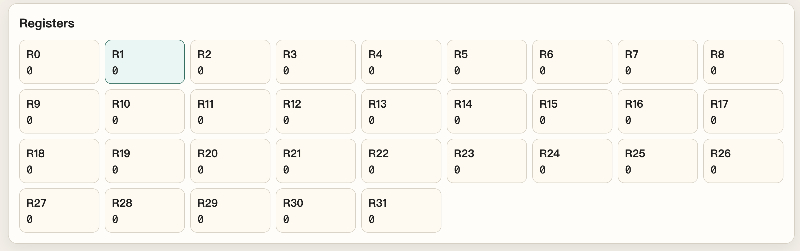
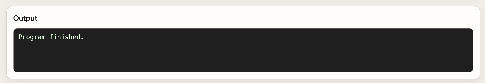

### Memory & Heap Views

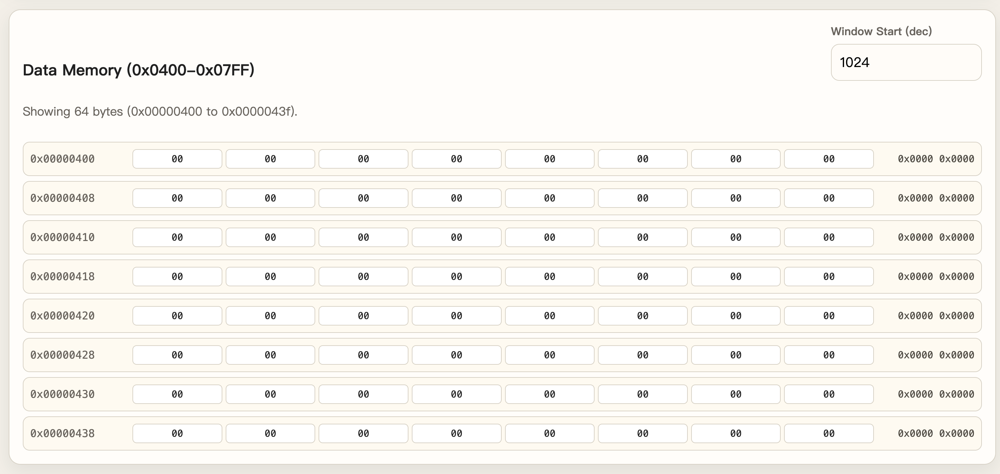
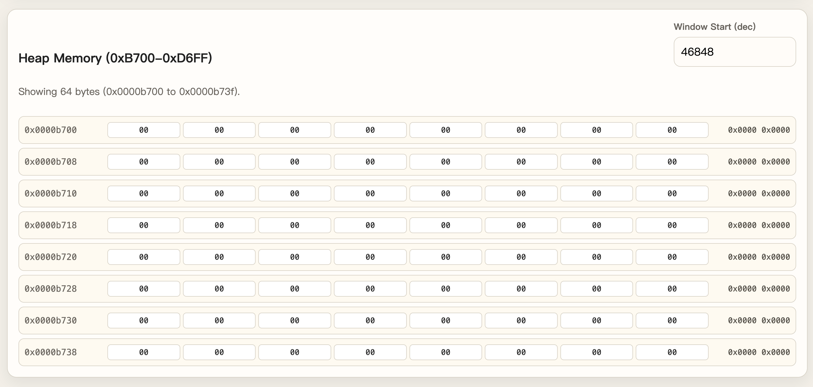
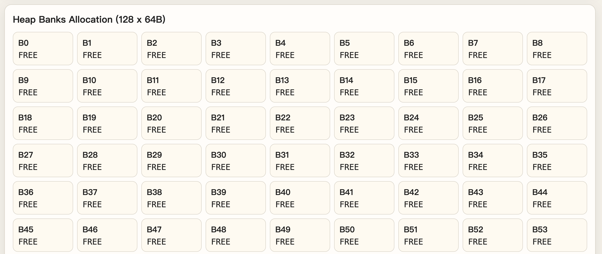

### Built-in Documentation Panels

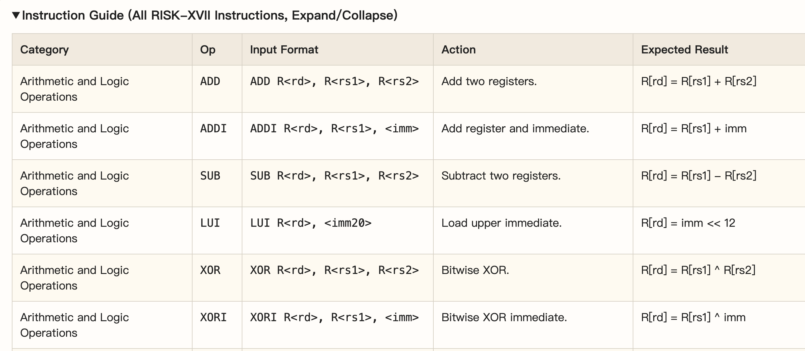
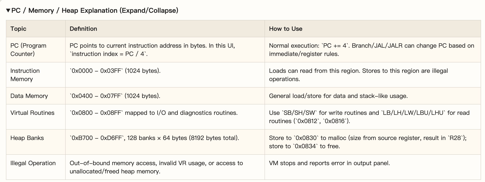
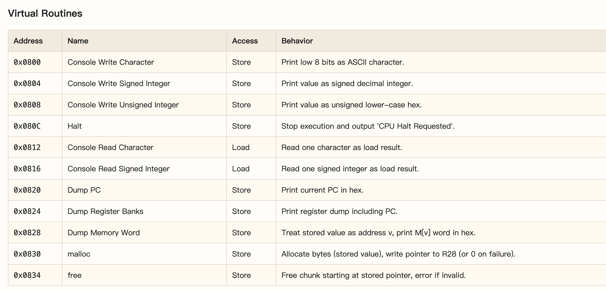

## Tech Stack

### CLI

- C
- GCC/Clang via Make

### Web

- Next.js 14
- React 18
- TypeScript
- CSS
- Node.js/npm

## Project Structure

```text
.
├── cli/
│   ├── vm_riskxvii.c
│   ├── vm_riskxvii.h
│   ├── Makefile
│   ├── README.md
│   └── examples/
├── web/
│   ├── app/page.tsx
│   ├── app/globals.css
│   ├── app/api/run/route.ts
│   └── README.md
├── docs/
│   └── images/
├── Makefile
└── Dockerfile
```
